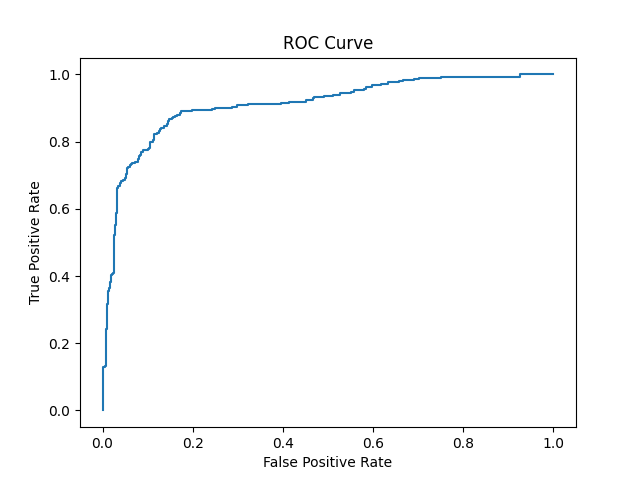

# Customer Purchase Prediction Model

This project uses machine learning to identify high-value repeat customers based on retail transaction data.
The goal is to help businesses better understand customer behavior and make data-driven decisions to improve retention, targeting, and revenue.

## Project Overview / Business Problem
Companies often struggle to identify which customers are most valuable and likely to return.
By predicting high-value repeat customers, businesses can:
- Focus marketing efforts on the right audience
- Improve customer retention strategies
- Increase long-term revenue
- Identify loyal customers
- Predict future purchasing behavior

## Dataset
Source: Online Retail Dataset (UCI Machine Learning Repository)
Contains transactional data including:
- Invoice numbers
- Product descriptions
- Quantity purchased
- Transaction dates
- Customer IDs
- Country

Dataset is not included due to size limitations.

You can download it from the UCI Machine Learning Repository

## Methodology
1. Data Cleaning & Preprocessing
- Removed missing values and invalid records
- Converted date columns into proper datetime format
- Created a TotalPrice feature (Quantity × UnitPrice)
  
2. Feature Engineering (RFM Analysis)
Customers were grouped using:
- Recency → Days since last purchase
- Frequency → Number of transactions
- Monetary → Total amount spent
These features help quantify customer value and behavior.

3. Model Development
Two classification models were built and compared:
- Logistic Regression
- K-Nearest Neighbors (KNN)
  
4. Model Evaluation
Performance was evaluated using:
- Accuracy
- Precision, Recall, F1-score
- ROC Curve
- ROC-AUC Score

## Results
- ROC-AUC Score: ~0.90
- Strong model performance in predicting high-value customers

## Model Performance

### Logistic Regression
- Accuracy: ~0.87
- ROC-AUC: ~0.91

### K-Nearest Neighbors (KNN)
- Accuracy: ~0.85
- ROC-AUC: ~0.89

The Logistic Regression model performed better overall and was selected as the final model.

## ROC Curve


## Key Takeaways
- RFM features are effective in capturing customer behavior patterns
- Logistic Regression performed slightly better than KNN
- Strong ROC-AUC (~0.91) indicates good model performance
  
The model can successfully distinguish high-value vs low-value customers

## Tech Stack
- Python
- Pandas
- NumPy
- Scikit-learn
- Matplotlib


## How to Run
1. Clone the repository
````
git clone https://github.com/salmataa/customer-purchase-prediction.git
````
3. Install dependencies:
```
pip install pandas numpy matplotlib scikit-learn openpyxl
```
3. Run:
```
python retail_model.py
```

---

## Business Impact
This model can help companies:
- Identify loyal and high-value customers
- Personalize marketing campaigns
- Allocate resources more efficiently
- Increase customer lifetime value (CLV)

---

## Author
Salmata Gueye
